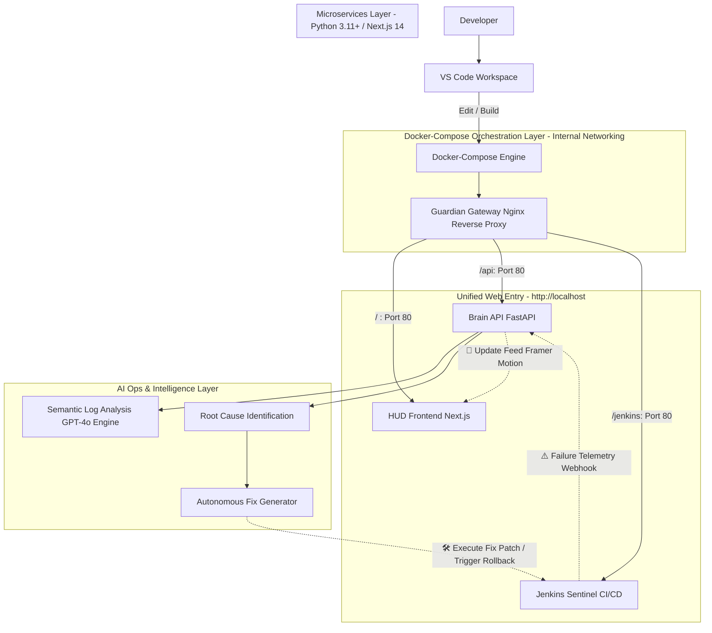
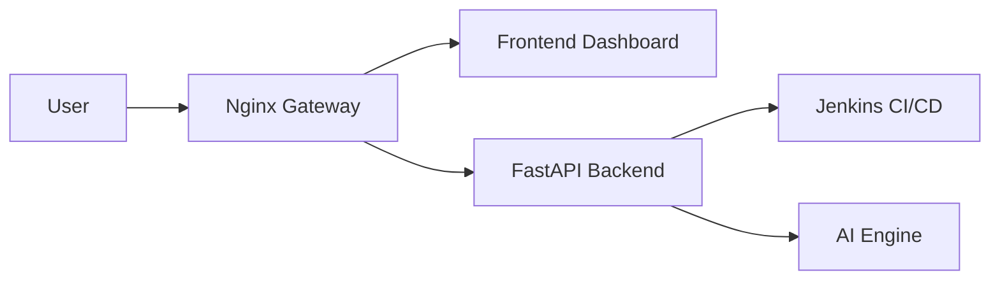
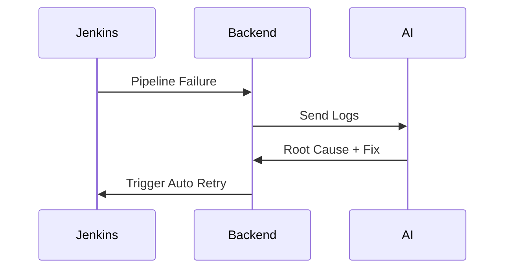
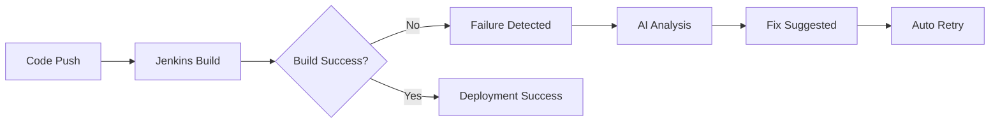
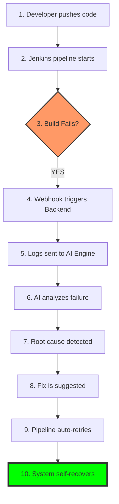

# 🛡️ PIPELINE GUARDIAN  
## ⚡ The Autonomous DevOps Sentry  
### 🌌 Where Artificial Intelligence meets DevOps Resilience  

<p align="center">
  
</p>

---

<p align="center">
  🧠 AI-Powered • 🔁 Self-Healing • ⚙️ Zero-Touch DevOps • 🚀 Autonomous CI/CD
</p>

<p align="center">
  
  
  
  
  
</p>

---

# 🌌 Vision

Pipeline Guardian transforms CI/CD pipelines into **self-healing autonomous systems powered by AI intelligence**.

It:
- 🧠 Understands pipeline failures  
- 🔍 Detects root causes  
- 🛠️ Suggests fixes  
- ⚡ Automatically recovers pipelines  

---

# 🎯 Problem Statement

| Traditional CI/CD | Limitations |
|------------------|-------------|
| Jenkins Pipelines | Manual debugging |
| Log Files | Overwhelming noise |
| Alerts | No intelligence |
| Recovery | Human dependency |

---

# 💡 Solution

Pipeline Guardian introduces an **AI-powered DevOps intelligence layer**:

✔ Captures pipeline failure events  
✔ Sends logs to LLM engine  
✔ Performs root cause analysis  
✔ Generates fix suggestions  
✔ Executes auto-retry pipeline  

---

# 🏗️ SYSTEM ARCHITECTURE

## 🔄 CI/CD FLOW (Core Engine)

## 🏗️ Isolated, Docker-Orchestrated AIOps Architecture


##🧩 MICRO-SERVICES ARCHITECTURE

##🔁 SELF-HEALING LOOP

##⚙️ DEVOPS LIFECYCLE FLOW

##  EXECUTION FLOW

##📂 PROJECT STRUCTURE
## 📂 PROJECT STRUCTURE

```text
pipeline-guardian/                 <-- Root Folder (Open this in VS Code)
│
├── .gitignore                      # Tells Git what to ignore (node_modules, venv, secrets)
├── docker-compose.yml              # The Master Controller (The "Boss")
├── README.md                       # The Mindblowing Documentation
│
├── 📂 backend/                     # THE BRAIN (Python/FastAPI)
│   ├── main.py                     # Entry point for the API
│   ├── requirements.txt            # Python dependencies
│   ├── Dockerfile                  # Instructions to build the Brain image
│   └── 📂 services/                # Logic for AI, Jenkins connection, etc.
│
├── 📂 frontend/                    # THE HUD (Next.js/React)
│   ├── app/                        # Next.js App Router (pages/components)
│   ├── public/                     # Static assets (logos, icons)
│   ├── package.json                # JS dependencies
│   └── Dockerfile                  # Instructions to build the HUD image
│
├── 📂 infra/                       # THE GATEWAY (Nginx)
│   └── nginx.conf                  # The Routing Logic (The "Front Door")
│
└── 📂 jenkins/                     # THE SENTINEL (CI/CD)
    ├── Dockerfile                  # (Optional) Custom Jenkins setup
    ├── scripts/                    # Your .sh cleanup and fix scripts
    └── 📂 jenkins_data/            # Persistent storage (DO NOT PUSH TO GIT)
```
##🧠 TECH STACK
<p align="center">  </p>
✨ KEY FEATURES
🔁 Self-healing CI/CD pipelines
🧠 AI log reasoning engine
⚡ Real-time failure detection
🛠️ Auto fix suggestion system
📊 Live DevOps dashboard
🚀 Zero-touch recovery system

📦 One-Click Deployment
# Clone the repository
git clone [https://github.com/tharunikan6-ai/pipeline_guardinas.git](https://github.com/tharunikan6-ai/pipeline_guardinas.git)

# Ignite the Guardian
docker-compose up --build
